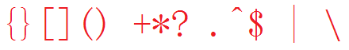

# 单个ASCII码的正则表达式(C#)

Meta char in C#

## 9-38

| 9   | 10  | 13  | 32 | 33 | 34 | 35 | 36   | 37 | 38 |
|-----|-----|-----|----|----|----|----|------|----|----|
| 9   | A   | D   | 20 | 21 | 22 | 23 | 24   | 25 | 26 |
| \\t | \\n | \\r |    | !  | "  | \# | \$   | %  | &  |
| \\t | \\n | \\r |    |    |    |    | \ &#36; |    |    |

## 39-48

| 39 | 40  | 41  | 42   | 43  | 44 | 45 | 46  | 47 | 48 |
|----|-----|-----|------|-----|----|----|-----|----|----|
| 27 | 28  | 29  | 2A   | 2B  | 2C | 2D | 2E  | 2F | 30 |
| '  | (   | )   | \*   | \+  | ,  | \- | .   | /  | 0  |
|    | \\( | \\) | \\\* | \\+ |    |    | \\. |    |    |

## 49-58

| 49 | 50 | 51 | 52 | 53 | 54 | 55 | 56 | 57 | 58 |
|----|----|----|----|----|----|----|----|----|----|
| 31 | 32 | 33 | 34 | 35 | 36 | 37 | 38 | 39 | 3A |
| 1  | 2  | 3  | 4  | 5  | 6  | 7  | 8  | 9  | :  |
|    |    |    |    |    |    |    |    |    |    |

## 59-68

| 59 | 60 | 61 | 62 | 63  | 64 | 65 | 66 | 67 | 68 |
|----|----|----|----|-----|----|----|----|----|----|
| 3B | 3C | 3D | 3E | 3F  | 40 | 41 | 42 | 43 | 44 |
| ;  | \< | =  | \> | ?   | \@ | A  | B  | C  | D  |
|    |    |    |    | \\? |    |    |    |    |    |

## 69-78

| 69 | 70 | 71 | 72 | 73 | 74 | 75 | 76 | 77 | 78 |
|----|----|----|----|----|----|----|----|----|----|
| 45 | 46 | 47 | 48 | 49 | 4A | 4B | 4C | 4D | 4E |
| E  | F  | G  | H  | I  | J  | K  | L  | M  | N  |
|    |    |    |    |    |    |    |    |    |    |

## 79-88

| 79 | 80 | 81 | 82 | 83 | 84 | 85 | 86 | 87 | 88 |
|----|----|----|----|----|----|----|----|----|----|
| 4F | 50 | 51 | 52 | 53 | 54 | 55 | 56 | 57 | 58 |
| O  | P  | Q  | R  | S  | T  | U  | V  | W  | X  |
|    |    |    |    |    |    |    |    |    |    |

## 89-98

| 89 | 90 | 91  | 92   | 93       | 94   | 95 | 96 | 97 | 98 |
|----|----|-----|------|----------|------|----|----|----|----|
| 59 | 5A | 5B  | 5C   | 5D       | 5E   | 5F | 60 | 61 | 62 |
| Y  | Z  | [   | \\   | ]        | \^   | \_ | \` | a  | b  |
|    |    | \\[ | &#92;&#92; | ] or \\] | \\\^ |    |    |    |    |

## 99-108

| 99 | 100 | 101 | 102 | 103 | 104 | 105 | 106 | 107 | 108 |
|----|-----|-----|-----|-----|-----|-----|-----|-----|-----|
| 63 | 64  | 65  | 66  | 67  | 68  | 69  | 6A  | 6B  | 6C  |
| c  | d   | e   | f   | g   | h   | i   | j   | k   | l   |
|    |     |     |     |     |     |     |     |     |     |

## 109-118

| 109 | 110 | 111 | 112 | 113 | 114 | 115 | 116 | 117 | 118 |
|-----|-----|-----|-----|-----|-----|-----|-----|-----|-----|
| 6D  | 6E  | 6F  | 70  | 71  | 72  | 73  | 74  | 75  | 76  |
| m   | n   | o   | p   | q   | r   | s   | t   | u   | v   |
|     |     |     |     |     |     |     |     |     |     |

## 119-128

| 119 | 120 | 121 | 122 | 123      | 124  | 125      | 126 | 127 | 128 |
|-----|-----|-----|-----|----------|------|----------|-----|-----|-----|
| 77  | 78  | 79  | 7A  | 7B       | 7C   | 7D       | 7E  | 7F  | 80  |
| w   | x   | y   | z   | {        | \|   | }        | \~  |     |     |
|     |     |     |     | { or \\{ | \\\| | } or \\} |     |     |     |

# End
