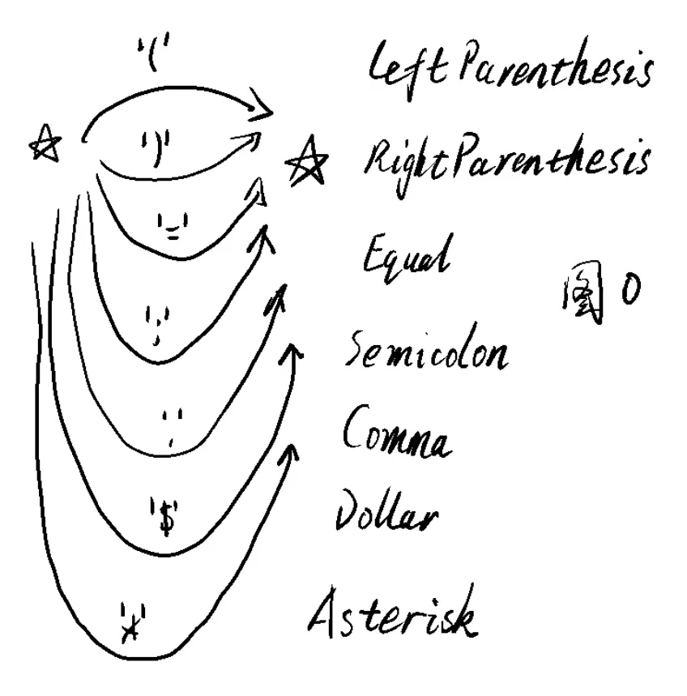
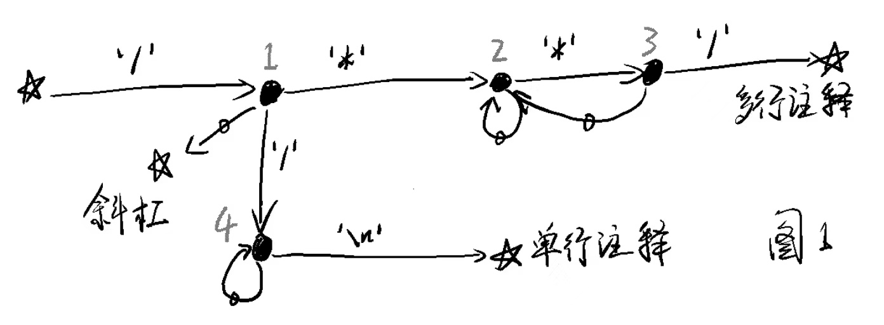
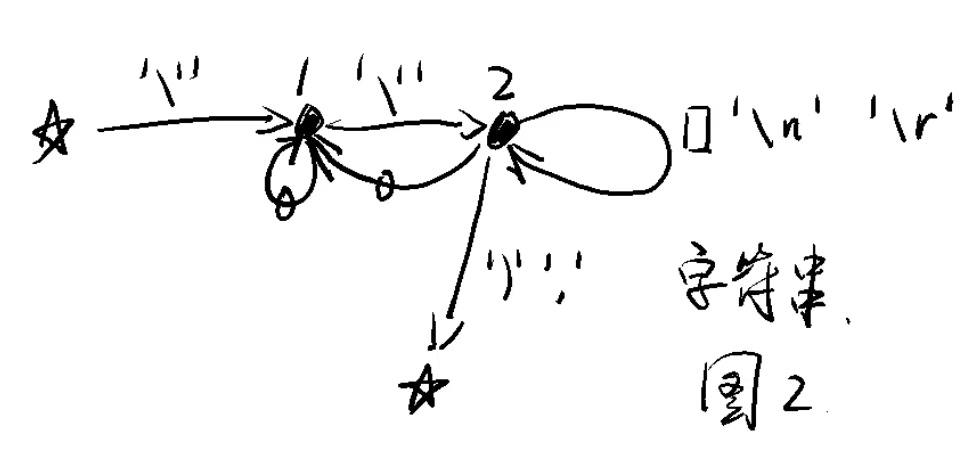
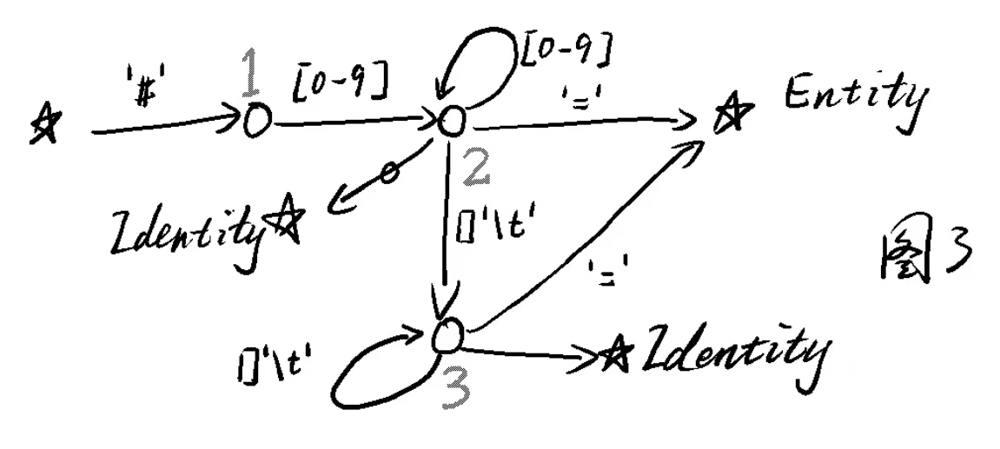
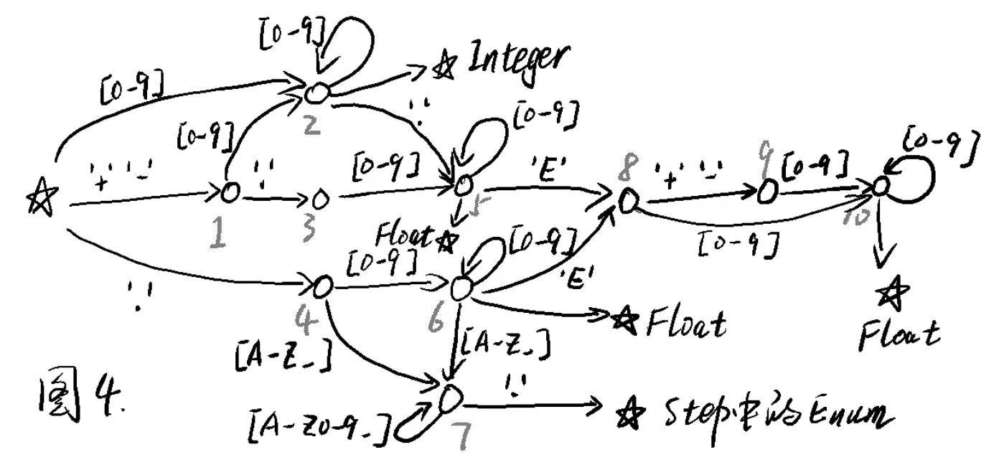
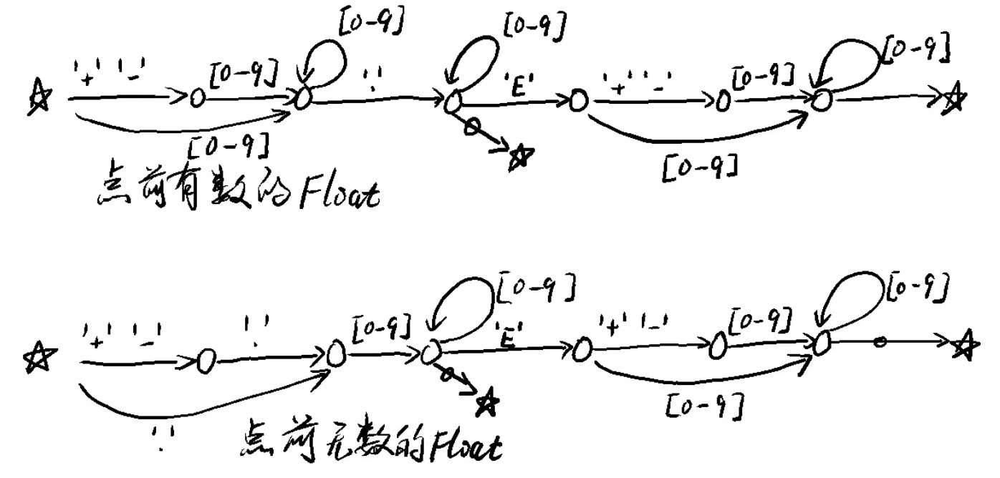
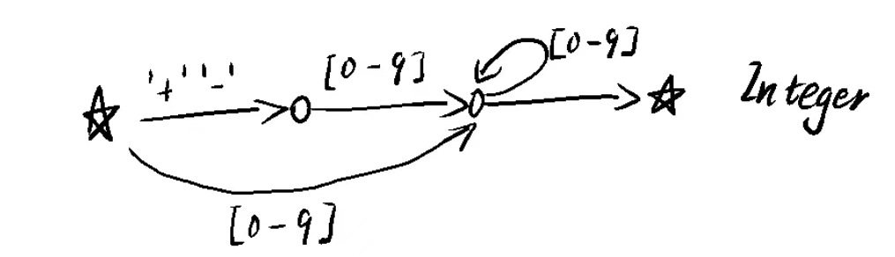
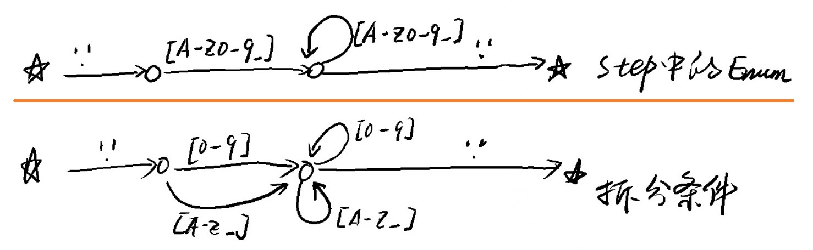
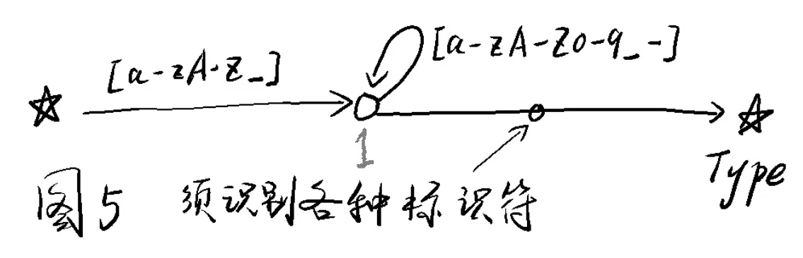

# `*.step`文件的词法分析器（Analyzer）


词法分析的原理是状态机（State Machine）。词法分析的过程就是：看第一个`char`是什么，就能判定它和它后面若干个`char`可能组成哪一类或哪几类的`Token`；然后一个`char`一个`char`地拼接出这个`Token`来。这时候指针（`Cursor`）就指到了下一个`Token`的第一个`char`，重复上述过程。

词法分析的作用可以和计算机网络7层协议里的数据链路层的作用类比。数据链路层把可能出错的物理层的数据打包成一个个不会有错的`数据报`，供上层协议继续分析。词法分析器将纯字符串的源代码变成一个个具有顺序、类型和内容的`Token`，减轻了语法分析的复杂性。

下面各图是状态机的各个部分。它们合在一起就是Analyzer的核心――总状态机。

## 初始状态☆

图0中的五角星☆表示初始状态，也就是Analyzer在分析第一个`char`之前时的状态。



如图所示，处于☆状态的词法分析器，若遇到的`char`是`'('` `')'` `'='` `';'` `'$'` `'*'`中的一个，就新增一个相应的`Token`，而后返回☆状态。

```
class LexiRule {
    // 返回true时表示应当使用本对象中的function
    // Return true if current char matches this rule,
    // and that's when the function should be applied.
    public readonly Func<char, bool> matchingRule;
    // 本规则应当进行的具体操作。
    // 返回值是下一个State对象，即状态机的下一个状态。
    // function of this rule.
    // It returns next State object.
    public readonly Func<LexiContext, State> function;

    public LexiRule(Func<char, bool> matchingRule, Func<LexiContext, State> function)
    {
        this.matchingRule = matchingRule;
        this.function = function;
    }
}
...
    var rule = new LexicalRule(
        currentChar => currentChar == '(',
        context =>
        {
		    // add a Token
            var token = new Token(context.Cursor, context.Line, context.Column);
            token.type = EType.LeftParenthesis;
            token.Value = "(";
            context.result.Add(token);
            return state0; // return back to state☆
        });
```
这里使用了匿名方法（anonymous method），无须给各个`function`手动起名，优雅。

整个词法分析的抽象过程如下：

```
    public TokenList Analyze(string content)
    {
        var context = new LexiContext(content);
        while (!context.EOF)
        {
            char currentChar = context.CurrentChar;
            Func<LexiContext, State> function = context.state.GetAction(currentChar);
            State nextState = function(context);
            context.state = nextState;
            context.MoveForward(); // Cursor++
        }
        // finish lexical analyzing with external char('\0').
        {
            char currentChar = context.CurrentChar;
            Func<LexiContext, State> function = context.state.GetAction(currentChar);
            State nextState = function(context);
            context.state = nextState;
            context.MoveForward(); // actually not needed.
        }
    
        return context.result;
    }
```

## 识别注释

首先来识别注释，这样就可以排除它的干扰了。



如上图所示，它也以初始状态☆开始，以初始状态☆结束。这样，识别完一个注释后，就恢复到了最初状态，就可以继续识别下去了。

注意，图1中每个黑点都是一个不同的状态，我将图1中的黑点1，命名为状态`1_1`，黑点2命名为状态`1_2`，等等。由于图0中只有1个初始状态☆，我仅将它命名为状态`0`。

状态`1_1`，它遇到`'*'`时，应进入状态`1_2`；它遇到`'/'`时，应进入状态`1_4`；它遇到其他`char`时，应进入状态`0`，即初始状态☆。

状态`1_2`，当它遇到`'*'`时，应进入状态`1_3`；它遇到其它`char`时，应再次进入状态`1_2`。注意图1中从状态`1_2`进入状态`1_2`的箭头，身上画了一个小圆圈，我让它表示`所有其它char`这个意思。

效果如下图所示：


## 识别字符串

`*.step`文件中的字符串也比较复杂，容易影响对其他`Token`的识别，所以先处理它。



在`*.step`文件中`'John's bag',`是一个字符串，因为它后面接着`','`（或`')'`）。

这就是说，要在读到了那个`','`的时候，才能确定，我们拿到了一个完整的字符串（`John's bag`）。这就要求我们在`function`中将光标`Cursor`后退一位，以便下次能处理这个`','`。

```
    var rule = new LexicalRule(
        currentChar => currentChar == ',' || currentChar == ')' ,
        context =>
        {
            var token = context.result.Last();
            var str = context.Substring(token.index, context.Cursor - token.index);
            int length = str.Length;
            token.Value = str.TrimEnd();
            // read those ' ' '\n' '\r' ',' or ')' again.
            context.MoveBack(length - token.Value.Length + 1);
            return state0;
        }),
```

## 识别Entity和Identity

如果在`*.step`文件中有这样一行：
```
#14 = PRODUCT_DEFINITION('design', ' ', #6, #3) ;
```
那么，`#14`是个`Entity`类型的`Token`，而`#6` `#3`是`Identity`类型的`Token`。也就是说，最终遇到了`=`的，就是个`Entity`，最终遇到了`,`（或`)`）的，就是个`Identity`。这和对字符串的处理类似。



## 识别数值等

如果在`*.step`文件中有这样的两行：
```
#61 = CARTESIAN_POINT('Vertex', (-1.2, +3.E5, -.4E-6)) ;
#527 = B_SPLINE_CURVE_WITH_KNOTS('', 49, (#528,#529,#530,#531,#532), .002002. , .F., .U., (78, 91),(23., .74), .UNSPECIFIED. ) ;
```
那么，`-1.2` `+3.E5` `-.4E-6` `23.` `.74`是`Float`类型的`Token`，`49` `78` `91`是`Integer`类型的`Token`，`.UNSPECIFIED.` `.002002.` `.F.` `.U.`是`Enum`类型的`Token`。

也就是说，对`Float` `Integer` `Enum`的识别是混合起来的：读到第一个`.`、随后一个数字（`[0-9]`)的时候，无法确定它将带来一个`Float`还是`Enum`；读到`+` `-` 或第一个数字（`[0-9]`)的时候，无法确定它将带来一个`Integer`还是`Float`。因此这一节识别的是“数值等”。



这个略显复杂的图4，可以由3个简单的状态机合成：

关于`Float`的部分：



关于`Integer`的部分：此图中`+` `-`之后的状态，与`4-1`融合为一；随后的状态，不能融合。



关于`Enum`的部分：将遇到`[A-Z0-9_]`拆分为遇到`[0-9]`或`[A-Z_]`，以便与上面的状态图融合。



将这3个状态机融合起来，就是图4了。这个融合过程，隐含着实现lex所需要的算法。

## 识别keyword和Type

如果在`*.step`文件中有这样的几行：
```

HEADER;
FILE_DESCRIPTION(('xxx'),'2;1');

FILE_NAME('C:\\xxx.step','2021-12-14T06:27:09+00:00',('none'),('none'),'xxxx','xxxx','none');

FILE_SCHEMA(('xxxx'));

ENDSEC;
DATA;
...
#61 = CARTESIAN_POINT('Vertex', (-1.2, +3.E5, -.4E-6)) ;
...
ENDSEC;

```
那么`HEADER` `ENDSEC` `DATA`就是step文件保留的关键字（keyword），它们每个都是一个单独类型的`Token`。而`CARTESIAN_POINT` `B_SPLINE_CURVE_WITH_KNOTS` 都是`Type`类型的`Token`。



由于它们都是字母、数字、下划线的组合，所以只好在图5中最后的`function`中区分。

```
    var rule = new LexicalRule(
        // NOTE: this rule should only be put in the last position, as this is a lazy coding style!
        currentChar => true,
        context =>
        {
            var token = context.result.Last();
            string str = context.Substring(token.index, context.Cursor - token.index);
            char c = context.CurrentChar;
            switch (str)
            {
                case "STEP": token.type = c == ';' ? EType.STEP : EType.Error; break;
                case "HEADER": token.type = c == ';' ? EType.HEADER : EType.Error; break;
                case "ENDSEC": token.type = c == ';' ? EType.ENDSEC : EType.Error; break;
                case "DATA": token.type = c == ';' ? EType.DATA : EType.Error; break;
                case "ENDSTEP": token.type = c == ';' ? EType.ENDSTEP : EType.Error; break;
                // TODO: 逐一地详细区分这些Type。
                default: token.type = EType.Type; break;
            }
            if (token.type == EType.Error)
            {
                context.result.errorDict.Add(token, new TokenErrorInfo("Missing [;]"));
                token.Value = str;
                context.MoveBack(1);
            }
            else if (token.type == EType.Type)
            {
                token.Value = str;
                context.MoveBack(1);
            }
            else // some keywordXXX
            {
                token.Value = str;
            }
        
            return state0;
        }),
```

# 总结

要给某个格式的文件写词法分析器，就先找到它的lex文件，分析lex里的Rule（正则表达式），总结出上述的那些状态机（图1-图5），而后用代码描述这些图，词法分析器就成了。

等我写完语法分析器（Syntax Parser），我再重写一次自己的lex+yacc，可能还要做个正则表达式引擎。
